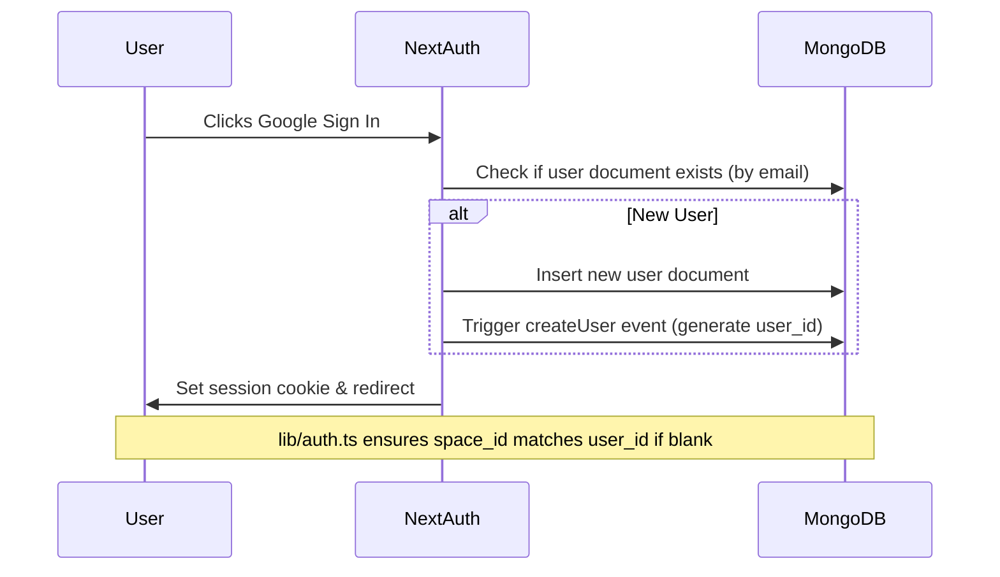
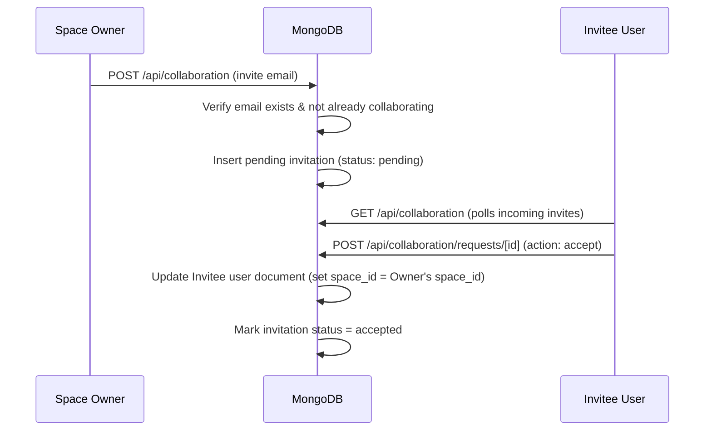

# Project Context

This document explains the purpose, users, functional features, current status, flows, and limitations of the **Hisab Management** system.

## App Goal
The primary objective of Hisab Management is to provide a single, modern, and rapid interface for individuals and families to manage their daily expenses, personal lending/borrowing records (Hisab), and family event gift registries (Marriage/Vayvhar vyavhar). It aims to offer cloud-based accessibility and real-time collaboration with zero load-time lag.

## Main Users
*   **Individuals & Families**: Who want a unified, mobile-friendly ledger to track where their money goes.
*   **Creditors & Borrowers**: Who need a simple ledger to track money owed to or by friends, family, or business contacts (Hisab ledger).
*   **Event Hosts**: Who want to track gifts and cash envelopes (Vayvhar) received from friends and relatives during marriages or family events, with automatic logging of corresponding expenses or receipts.

## Main Features

### 1. Dashboard Overview
*   Visual cards displaying total credit, total debit, current balance, and marriage records.
*   Recent ledger transactions list for quick reviews.
*   Interactive charts (via Recharts) displaying financial health.

### 2. Multi-line Quick Expense Entry
*   Allows users to paste list items (e.g., `Milk 50\nBread 30\nTaxi: 150`) into a single text block.
*   Intelligent regex-based parser extracts item name, amount, note, and identifies inline date shifts (e.g., `yesterday` or `2026-06-03`).
*   Validates items against a configured large amount threshold (default 10,000 INR) and raises warnings before saving.

### 3. Hisab (Credit/Debit Ledger)
*   Standard ledger records representing money owed to others (debit) or by others (credit).
*   Optional mapping to automatically log the transaction inside the expense tracker as debt/credit.
*   Sortable list with instant search and inline updates.

### 4. Marriage/Vayvhar Registry
*   Tracks gifts (cash, items) received from family and friends.
*   Fields include name, city/village, amount, and date.
*   Can automatically log as an expense (e.g., standard social exchange).

### 5. Multi-User Collaboration
*   Shared workspace architecture via invitation links.
*   Users can send invitations by email to others who have signed in at least once.
*   Upon acceptance, the collaborator's active `space_id` is updated to the owner's `space_id`, creating a shared database experience.
*   Collaborators can leave a shared space to return to their private database space at any time.

### 6. Excel, CSV, & PDF Exporting
*   Users can export current data filters (history, ledgers) directly to PDF reports, Excel tables (`.xlsx`), or comma-separated CSV logs.

### 7. Custom Space Settings
*   Configures primary currency (default INR), warning limit for large amounts, and in-app backup reminders (monthly frequency).

---

## Current Implementation Status

The application is partially completed. Core logic is highly functional, but multiple placeholder routes remain unimplemented.

### Active/Implemented Modules
*   **Authentication & Session Management**: Google OAuth via NextAuth, database session adapter, and automatic user record provisioning.
*   **Expenses & Multi-line Parser**: The quick add parser, list view, history, pagination, edit, delete, and validation.
*   **Hisab & Marriage Ledgers**: GET/POST/PUT/DELETE API endpoints and associated React page clients.
*   **Collaboration System**: Invitation posting, acceptance/rejection flow, and space membership sharing.
*   **System Settings**: Configuration reads/updates and MongoDB connections.
*   **Exports**: CSV, Excel, and PDF generation wrappers.

### Placeholder/Empty Modules (Unimplemented)
*   **Recycle Bin (`/bin`)**: The API (`app/api/bin/*`) and page route (`app/(protected)/bin/*`) exist as empty directories in the codebase.
*   **Session/Location Tracking (`/tracker` & `/tracking`)**: The API endpoints (`/api/tracker/*`, `/api/tracking/*`) and protected page route (`/tracker/*`) are empty placeholder folders.
*   **Contacts CRUD (`/api/contacts/[id]`)**: The API folder is empty.
*   **Setup Configuration (`/api/setup` & `/app/(protected)/setup`)**: Empty directories.
*   **Debug Sessions (`/api/debug-sessions`)**: Empty directory.

---

## Important Flows

### 1. User Creation & Session Setup

### 2. Workspace Collaboration Flow

---

## Known Limitations & Design Constraints
1.  **Orphaned Shared Records**: If an invitee creates transactions inside a shared space and later leaves that space, those transactions will remain under the owner's `space_id` because their `space_id` is stamped in the record.
2.  **No MongoDB Transactions**: Relies on single-document operations. There is no multi-document transaction handling (e.g., if writing to `hisab` succeeds but logging as an expense fails, the ledger record is saved, but the expense won't be recorded).
3.  **No Schema-level DB Constraints**: All validation is handled at the API controller or client application layer. MongoDB collections do not enforce document schemas natively.

## Development Assumptions
*   **Base URL**: Relies on ngrok-free URL (`NEXT_PUBLIC_BASE_URL` / `NEXTAUTH_URL`) for redirection and authorization endpoints during staging/dev.
*   **Timezone**: Always calculations in `Asia/Kolkata`.
*   **Base Currency**: `INR` (Indian Rupee) is default and hardcoded in multiple validation steps.
